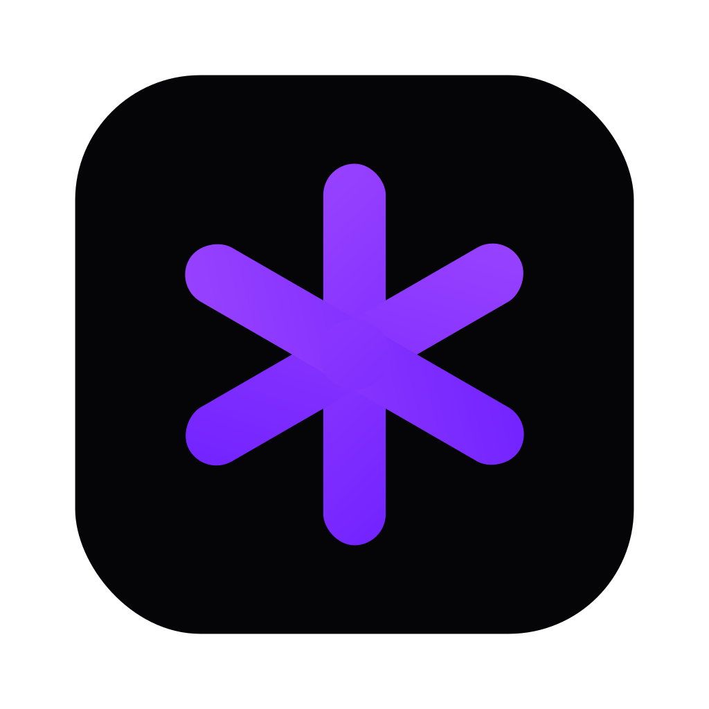
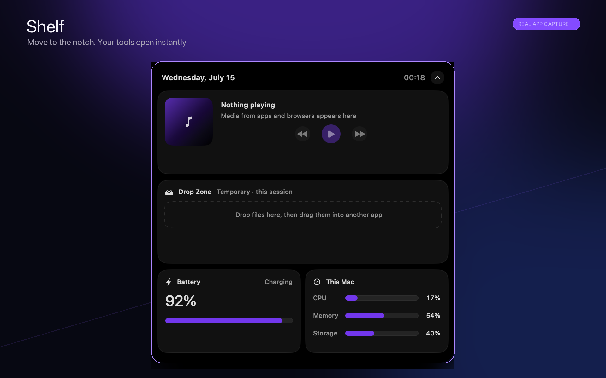
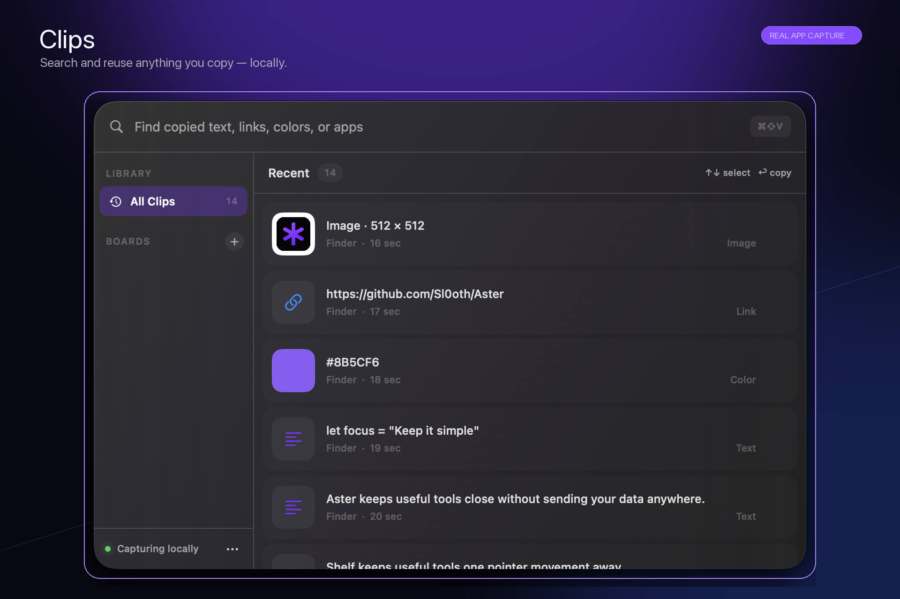
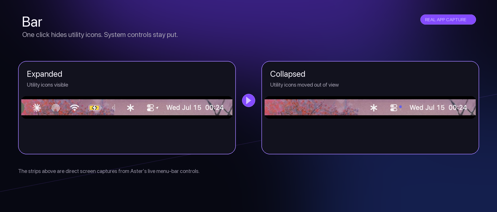

<div align="center">
  
  <h1>Aster</h1>
  <p><strong>Your Mac, your way.</strong></p>
  <p>A free, private, modular utility layer for macOS.</p>

  <p>
    <a href="https://github.com/Sl0oth/Aster/releases/latest"></a>
    
    
    
    <a href="LICENSE"></a>
  </p>
</div>

Aster brings the small tools you use all day into one focused Mac app. Enable only the modules you want—there is no account, analytics, telemetry, advertising, or forced cloud connection.

> [!NOTE]
> Aster is currently in public beta. Download the latest community build from [GitHub Releases](https://github.com/Sl0oth/Aster/releases/latest), or [build it from source](#build-from-source).

## See Aster in action

### Shelf

Move your pointer to the notch to open media controls, a temporary Drop Zone, battery information, system health, timers, shortcuts, weather, calendar, reminders, and recent clips.



### Clips

Press <kbd>Command</kbd> + <kbd>Shift</kbd> + <kbd>V</kbd> anywhere to search and reuse copied text, links, colors, and images. Clipboard history stays on your Mac, with password-manager exclusions built in.



### Bar

Group real third-party menu-bar icons behind Aster, then hide or reveal them with one click. System controls stay where they belong.



## Modules

- **Canvas** — Import, preview, organize, and independently assign still images, GIFs, or looping videos to the Desktop, Lock Screen, and Screen Saver. Includes a full-bleed editor, filtering, sorting, drag-and-drop import, destination badges, timed shuffle, and motion auto-resume.
- **Clips** — Keep an opt-in, local clipboard history with search, persistent boards, drag-and-drop, source-app labels, and password-manager exclusions.
- **Shelf** — Open a configurable, hover-activated notch panel for the utilities you want close at hand.
- **Bar** — Collapse and reveal native third-party menu-bar items while preserving their arrangement across launches.
- **Switch** — Put common local Mac controls—sleep, Finder, Dock, appearance, audio, and screenshots—in one place.
- **Keys** — Browse a Mac shortcut cheat sheet, change or disable supported shortcuts, and assign global hotkeys that open or focus any application.

Canvas, Clips, Shelf, Bar, Switch, and Keys are functional. Aster starts only the modules selected during onboarding, and every background-capable module can be disabled later.

### Find wallpapers for Canvas

Starting with an empty Canvas library? Browse [MotionBGs](https://motionbgs.com/) or [MoeWalls](https://moewalls.com/) for live-wallpaper ideas and downloads, then import the image, GIF, or video file into Aster.

Aster is not affiliated with either website. Review each download's source and usage rights before using it.

## Install

### Release build

When a public build is available, download it from [GitHub Releases](https://github.com/Sl0oth/Aster/releases/latest), move Aster to your Applications folder, and follow the one-time steps in [FIRST-LAUNCH.md](FIRST-LAUNCH.md).

Community builds are ad-hoc signed and are not notarized by Apple. Launch at login requires Aster to be copied into `/Applications` or `~/Applications`; macOS may request optional permissions again after an update.

### Build from source

Aster requires an Apple-silicon Mac with macOS 14 or later. Building requires Xcode 16 or later.

```bash
swift run Aster
```

For local development, use `ReleaseTools/run-development.sh` so Aster runs as a real application bundle with a stable identifier and icon:

```bash
ReleaseTools/run-development.sh
```

To create a distributable community build:

```bash
ASTER_RELEASE_MODE=community ReleaseTools/build-release.sh
```

See [ReleaseTools/README.md](ReleaseTools/README.md) for the complete publishing workflow.

## Set up Bar

1. Enable Bar in Aster.
2. Hold <kbd>Command</kbd> while dragging the thin divider to the right edge of the utility icons you want hidden.
3. Place the Aster menu-bar icon immediately to the divider's right.
4. Click Aster to collapse or reveal the group.

macOS stores the dragged status-item positions, while Aster stores its own Bar settings. Use **Reset Aster control positions** if the controls become separated. The Icon Spacing slider adjusts the system-wide gap between status items; system controls refresh when applied, while third-party menu apps may need to be reopened.

## Privacy

- Clipboard monitoring is off until you explicitly enable it.
- Clipboard history, boards, and locally stored image previews stay in `~/Library/Application Support/Aster`.
- Common password managers and Keychain are excluded from clipboard capture.
- Drop Zone file references last only for the current Aster session.
- Shortcuts and system health stay local.
- Shelf reads the active macOS Now Playing session. Music, Spotify, and Reminders automation is used only when explicitly available.
- Keys requires Accessibility only when applying changed or disabled macOS shortcuts. The cheat sheet and app hotkeys do not require it.
- Bar organizes native menu-bar icons without inspecting, recording, or imitating other apps, and does not require Accessibility permission.
- Weather stays offline until a city is entered. While enabled, only that city name is sent to Open-Meteo for geocoding and forecasts.
- Every watcher and permission belongs to a visible module and can be disabled.

## Updates

Aster checks its configured HTTPS release feed at launch and at most once every six hours. Release metadata must carry a valid Ed25519 signature from Aster's embedded update key. Aster verifies the semantic version, build number, minimum macOS version, HTTPS transport, and signed SHA-256 checksum before opening a download. After an upgraded version launches, Aster shows its bundled What's New notes once.

The signed update feed and community installers are hosted by the public [Sl0oth/Aster](https://github.com/Sl0oth/Aster) repository, so Aster does not depend on a separately operated update server.

## macOS limitations

### Motion wallpapers

macOS has no public API for arbitrary video wallpapers. Aster displays looping videos in click-through windows above the system wallpaper and below Finder's desktop icons. Aster must remain open while a motion wallpaper is active.

### Screen Saver and Lock Screen

Canvas can install its native `Aster.saver` module in `~/Library/Screen Savers`. Desktop, Lock Screen, and Screen Saver assignments are stored separately. Desktop and Screen Saver accept still or motion media. macOS allows only a still image on the secure Lock Screen, so Aster disables video and GIF selections for that destination and stores the chosen still in the system desktop layer.

## License

Aster is available under the [GNU Affero General Public License v3.0](LICENSE).
